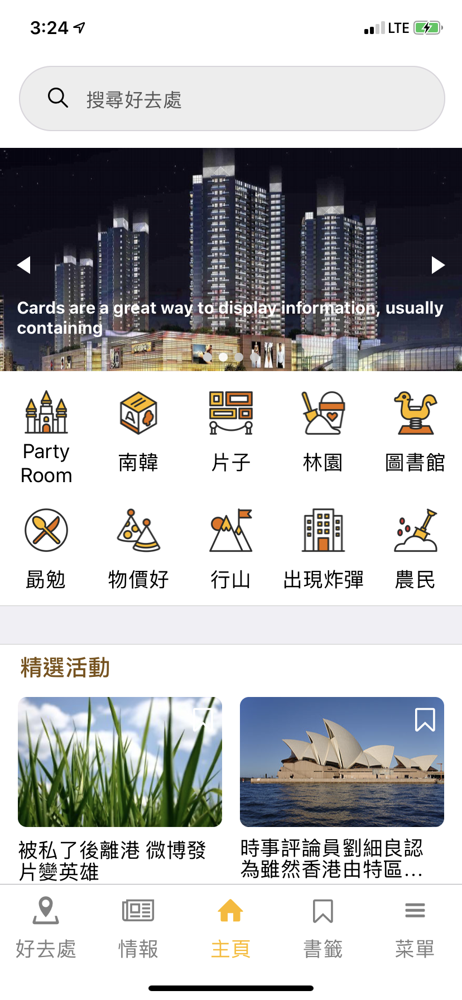

## GoBirdie Mobile App (React Native Expo) ##

A mobile app dedicated to parent-child groups so they could browse and search different activities with detailed descriptions.

Also, an admin portal for media editing and configuration: https://github.com/fmchan/GoBirdie-Backend

### Screenshots: ###

